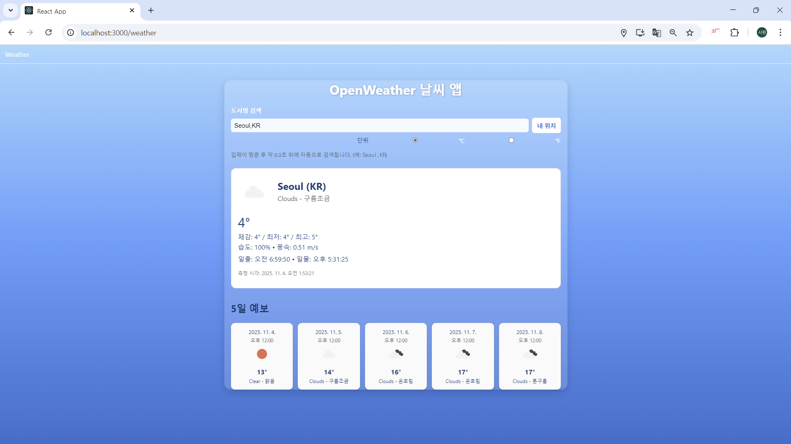
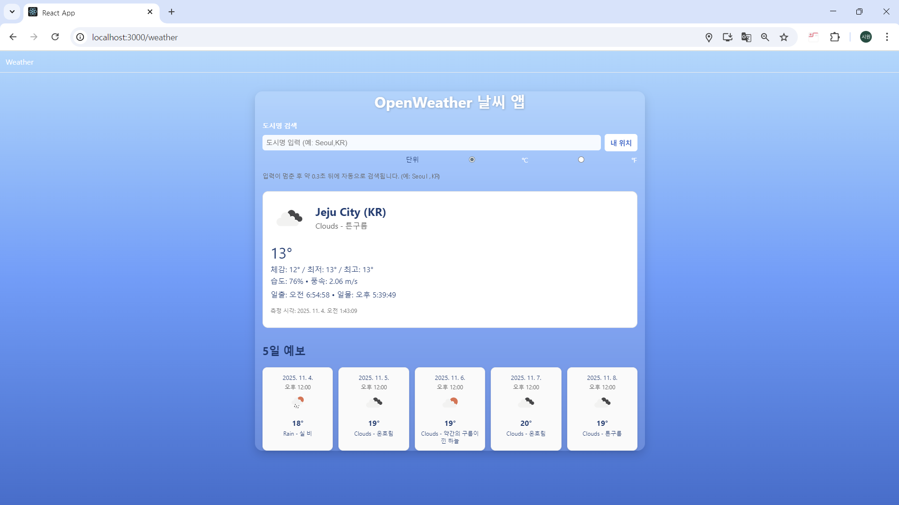

### 에러·로딩·타임아웃 처리 요약

API 호출 시 `try/catch`를 통해 네트워크 오류를 감지하고, `useState`로 `loading`과 `error` 상태를 관리했다.  
요청 전 `loading=true`, 완료 후 false로 설정해 UX를 개선했으며, 실패 시 `err.message`를 시각적으로 표시했다.  
추가로 `Promise.race` 기반 타임아웃(10초)을 적용해 응답 지연 시 사용자에게 즉시 안내하도록 했다.  
이 접근은 React 비동기 흐름에서 상태 분리를 명확히 하여 유지보수성과 피드백 속도를 높인다.

### 완성 화면
> 검색창, 내 위치 버튼, 예보 카드까지 표시되는 전체 페이지

### 도시 검색 결과

### 내 위치 결과
